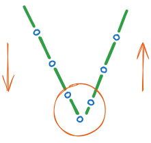
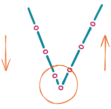
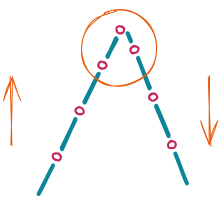
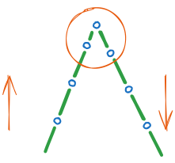

Start/End backtack
==================

The start backtack starts by pressing the pedal forward at the beginning of the seam.
Start backtack are executed automatically at speed :option:`S03`. They cannot be
interrupted. If softstart is running parallel, the respective lower speed is prevailing.

The end backtack in a seam with stitch counting starts by heelback at the end of
counting. The stitch regulator is immediately enabled from machine standstill. After
lowering the sewing foot, the switch-on point of the stitch regulator is delayed by the
time :option:`T06` (start delay after switching off the sewing foot lift signal)，and
machine start is delayed by the time :option:`T01` (start delay after switching on the
stitch regulator).

Stitch optimization
-------------------

.. important::

    Before adjustment, make sure that forward stitch length is the same with backward
    stitch length use the stitch regulator lever.

The time it takes for stitch regulator move into position, adjust parameter
:option:`T01` as the guide of following figure:

    Increase T01

    Decrease T01

The time it takes for stitch regulator release into position, adjust parameter
:option:`T02` as the guide of following figure:

    Increase T02

    Decrease T02

Ornamental backtack
-------------------

Function "Ornamental backtack" is used to ensure the seam looks better.

Difference from the standard start backtack:

- The drive stops for stitch regulator switching
- The stop time can be set

When the function is enabled, the motor will stop at the turning point and wait for the
time set by :option:`T11` to ensure that the stitch regulator action or release in
place, then the motor continue running.

Ornamental backtack can be enabled for start backtack or end backtack respectively,
controlled by :option:`A20` and :option:`A22`.

Holding Power of the Stitch Regulator Solenoid
----------------------------------------------

The stitch regulator solenoid is engaged by full power. Then the system switches
automatically to partial power in order to reduce the load for the control and the
connected solenoid. Set the duration of full power using parameter :option:`T08` and the
partial holding power using parameter :option:`O09`.

.. caution::

    If the holding power is set too high, the solenoid and the control may be
    permanently damaged. Please observe the permissible duty cycle of the solenoid and
    set the appropriate value.

Scheduled Switch Off
--------------------

To reduce heat generation, you can enable the timer switch-off function.

If parameter :option:`O10` is set to 1, the maximum time the stitch regulator can keep
switch on is determined by parameter :option:`O11`.

Quick reference
---------------

This table summarizes which parameter should be used for backtack:

========================================================== ========== =============
Parameter                                                  Authority  See also
========================================================== ========== =============
Start Backtack Speed                                       Operator   :option:`S03`
End Backtack Speed                                         Operator   :option:`S04`
Start Ornamental backtack                                  Operator   :option:`A20`
End Ornamental backtack                                    Operator   :option:`A22`
Time to move into position                                 Technician :option:`T01`
Time to release into position                              Technician :option:`T02`
Ornamental backtack stop time                              Technician :option:`T11`
Maintain Speed after Start Backtack                        Technician :option:`A34`
Switch-on angle                                            Technician :option:`D05`
Switch-off angle                                           Technician :option:`D06`
Scheduled Switch Off                                       Technician :option:`O10`
Upper limit Switch-on period                               Technician :option:`O11`
Max. Speed of 1 stitch                                     Technician :option:`O12`
Max. Speed of 2 stitch                                     Technician :option:`O13`
Max. Speed of 3 stitch                                     Technician :option:`O14`
Stitches Delay until enable the pedal after start backtack Technician :option:`O41`
Full power duration                                        Developer  :option:`T08`
Duty cycle after full power                                Developer  :option:`O09`
========================================================== ========== =============

Parameter List
--------------

.. option:: S03

    -Max  4500
    -Min  50
    -Unit  spm
    -Description  Maximum speed in backtack at seam begin.

.. option:: S04

    -Max  4500
    -Min  50
    -Unit  spm
    -Description  Maximum speed in backtack at seam end.

.. option:: A20

    -Max  1
    -Min  0
    -Unit  --
    -Description
      | Start ornamental backtack:
      | 0 = Off;
      | 1 = On.

.. option:: A22

    -Max  1
    -Min  0
    -Unit  --
    -Description
      | End ornamental backtack:
      | 0 = Off;
      | 1 = On.

.. option:: T01

    -Max  200
    -Min  1
    -Unit  ms
    -Description  Time required for the stitch regulator to move into position.

.. option:: T02

    -Max  200
    -Min  1
    -Unit  ms
    -Description  Time required for the stitch regulator to release into position.

.. option:: T11

    -Max  1000
    -Min  1
    -Unit  ms
    -Description  Waiting time, when ornamental backtack is enabled, the motor stops at the sewing direction change point and waits for the stitch regulator action to be completed.

.. option:: A34

    -Max  1
    -Min  0
    -Unit  --
    -Description
      | After start backtack, it is possible to delay the activation of the pedal, in order to maintain the speed at the end of backtack:
      | 0 = Off;
      | 1 = On.

.. option:: D05

    -Max  359
    -Min  0
    -Unit  1°
    -Description  Switch-on angle for stitch regulator in standard start/end backtack

.. option:: D06

    -Max  359
    -Min  0
    -Unit  1°
    -Description  Switch-on angle for stitch regulator in standard start/end backtack

.. option:: O10

    -Max  1
    -Min  0
    -Unit  --
    -Description
      | Stitch regulator scheduled switch off:
      | 0 = Off;
      | 1 = On

.. option:: O11

    -Max  30
    -Min  5
    -Unit  s
    -Description  If the timer function is enabled, this parameter value determines the maximum switch on time of stitch regulator.

.. option:: O12

    -Max  4500
    -Min  50
    -Unit  spm
    -Description  When the number of stitches for start/end backtack or W seam single section is set to 1, this parameter determines the maximum sewing speed.

.. option:: O13

    -Max  4500
    -Min  50
    -Unit  spm
    -Description  When the number of stitches for start/end backtack or W seam single section is set to 2, this parameter determines the maximum sewing speed.

.. option:: O14

    -Max  4500
    -Min  50
    -Unit  spm
    -Description  When the number of stitches for start/end backtack or W seam single section is set to 3, this parameter determines the maximum sewing speed.

.. option:: O41

    -Max  10
    -Min  0
    -Unit  stitches
    -Description  After start backtack, it is possible to delay the activation of the pedal, in order to maintain the speed at the end of backtack. This stitches lag can be selected by means of this parameter.

.. option:: T08

    -Max  999
    -Min  1
    -Unit  ms
    -Description  Stitch regulator: full power duration, :term:`time period t1` .

.. option:: O09

    -Max  100
    -Min  1
    -Unit  %
    -Description  Stitch regulator: duty cycle after full power in :term:`time period t2` .
