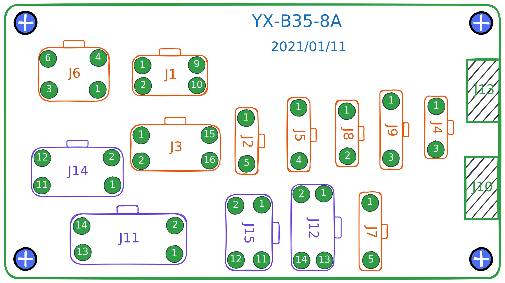

# Upper Hub (YX-B35-8A)

## Specifications

132mm x 58mm

## Top view

## To the control box

**J14** and **J11** are connected to the **X200** interface on the control box;

**J15** and **J12** are connected to the **X101** interface on the control box;

### J14

Connect to X200.

| Pin | Define    | Pin | Define    |
| --- | --------- | --- | --------- |
| 1   | DC31v     | 2   | DC31v     |
| 3   | DC31v     | 4   | DC31v     |
| 5   | Output-02 | 6   | Output-02 |
| 7   | Output-01 | 8   | Output-02 |
| 9   | Output-01 | 10  | Output-01 |
| 11  | Output-03 | 12  | Output-03 |

### J11

Connect to X200.

| Pin | Define    | Pin | Define    |
| --- | --------- | --- | --------- |
| 1   | Output-04 | 2   | Output-04 |
| 3   | Output-05 | 4   | Output-05 |
| 5   | Output-06 | 6   | Output-06 |
| 7   | Output-07 | 8   | Output-07 |
| 9   | Output-10 | 10  | Output-10 |
| 11  | Output-09 | 12  | Output-09 |
| 13  | Output-08 | 14  | Output-08 |

### J12

Connect to X101.

| Pin | Define            | Pin | Define            |
| --- | ----------------- | --- | ----------------- |
| 1   | Input-01(digital) | 2   | Input-07(analog)  |
| 3   | Input-10(analog)  | 4   | Input-05(digital) |
| 5   | Input-09(analog)  | 6   | Input-03(digital) |
| 7   | CHB2              | 8   | Input-06(digital) |
| 9   | CHA2              | 10  | Input-08(analog)  |
| 11  | -                 | 12  | GND               |
| 13  | DC12v             | 14  | DC12v             |

### J15

Connect to X101.

| Pin | Define             | Pin | Define            |
| --- | ------------------ | --- | ----------------- |
| 1   | VCC                | 2   | Machine ID-SCL    |
| 3   | Machine ID-SDA     | 4   | Input-02(digital) |
| 5   | Input-04(digital)  | 6   | Keypad-KEY        |
| 7   | Elec Handwheel-CHB | 8   | Keypad-CLK        |
| 9   | Elec Handwheel-CHA | 10  | Keypad-LOCK       |
| 11  | GND                | 12  | Keypad-DATA       |

## To peripherals

### J1

Default Use Case: Keypad.

| Pin | Define         | Pin | Define            |
| --- | -------------- | --- | ----------------- |
| 1   | VCC            | 2   | Keypad-DATA       |
| 3   | GND            | 4   | Keypad-LOCK       |
| 5   |                | 6   | Keypad-CLK        |
| 7   | Machine ID-SDA | 8   | Keypad-KEY        |
| 9   | Machine ID-SCL | 10  | Input-02(digital) |

### J6

Default Use Case: actuators, especially those driven by electromagnets.

| Pin | Define    | Pin | Define |
| --- | --------- | --- | ------ |
| 1   | Output-02 | 2   | DC31v  |
| 3   | Output-01 | 4   | DC31v  |
| 5   | Output-03 | 6   | DC31v  |

### J3

Default Use Case: actuators, such as solenoid valves or electromagnets.

| Pin | Define | Pin | Define    |
| --- | ------ | --- | --------- |
| 1   | DC31v  | 2   | Output-08 |
| 3   | DC31v  | 4   | Output-09 |
| 5   | DC31v  | 6   | Output-10 |
| 7   | DC31v  | 8   | Output-07 |
| 9   | DC31v  | 10  | Output-06 |
| 11  | DC31v  | 12  | Output-05 |
| 13  | DC31v  | 14  | Output-04 |
| 15  | -      | 16  | -         |

### J2

Default Use Case: electronic handwheel.

| Pin | Define             |
| --- | ------------------ |
| 1   | GND                |
| 2   | Elec Handwheel-CHA |
| 3   | Elec Handwheel-CHB |
| 4   | Input-04(digital)  |
| 5   | -                  |

### J5

Default Use Case:: potentiometer mounted inside the stroke wheel.

| Pin | Define           |
| --- | ---------------- |
| 1   | VCC              |
| 2   | GND              |
| 3   | Input-07(analog) |
| 4   | -                |

### J8

Default Use Case: knee switch.

| Pin | Define            |
| --- | ----------------- |
| 1   | Input-05(digital) |
| 2   | GND               |

### J7

Default Use Case: sensor for slide monitoring.

| Pin | Define            |
| --- | ----------------- |
| 1   | -                 |
| 2   | -                 |
| 3   | Input-01(digital) |
| 4   | GND               |
| 5   | DC12v             |

### J9

Default Use Case: sensor for tilt switch, 5V power supply for the headlamp.

| Pin | Define            |
| --- | ----------------- |
| 1   | VCC               |
| 2   | Input-03(digital) |
| 3   | GND               |

### J4

Default Use Case: sensor for eye protection.

| Pin | Define            |
| --- | ----------------- |
| 1   | -                 |
| 2   | Input-06(digital) |
| 3   | GND               |
